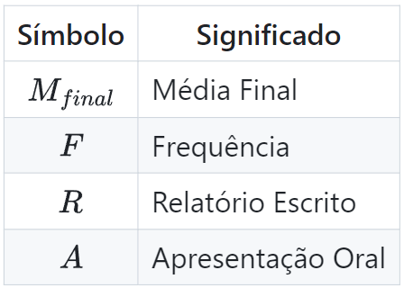

# CC0443 - Seminários de Ciência de Dados

Universidade Federal do Ceará

---

## Carga Horária

32h práticas

## Justificativa

É importante

1. conhecer a estrutura universitária (centro, departamento, corpo docente, etc.),
2. ter uma visão geral sobre a Ciência de Dados,
3. conhecer a profissão, as áreas de atuação, os estágios e bolsas de estudo. 

---

## Ementa

Visão geral sobre a Ciência de Dados: Desenvolvimento de Sistemas, Engenharia de Dados, Otimização, Mineração de Dados e Aprendizagem de Máquina. Métodos Estatísticos e Extensão. Apresentação da estrutura universitária: Pró-Reitoria de Graduação, Estrutura curricular, Corpo docente. A profissão, Áreas de Atuação, Estágios e Empregos, Bolsas de Estudo. Perspectivas. Coordenação do Curso: informações gerais com base no manual do aluno. Índice de Rendimento Acadêmico – IRA. Programa de Educação Tutorial – PET. Empresa Júnior e Centro Acadêmico. Pró-Reitoria de Assuntos Estudantis. Instituto Euvaldo Lodi – IEL. Instituto de Educação Física. Casas de Cultura Estrangeira. Palestras de Docentes.

---

## Objetivos Gerais

Apresentar a estrutura universitária, o corpo docente, a profissão, as áreas de atuação, os estágios, empregos e bolsas de estudo. Além disso, é importante que os alunos tenham uma visão geral sobre a Ciência de Dados, incluindo Desenvolvimento de Sistemas, Engenharia de Dados, Otimização, Mineração de Dados e Aprendizagem de Máquina. Métodos Estatísticos e Extensão.

--- 
## Objetivos Específicos

De forma específica, o programa visa apresentar 
- a Estrutura Curricular do Bacharelado em Ciência de Dados
- a organização universitária (Pró-Reitorias, o Centro de Ciências, os Departamentos e o Corpo Docente), 
- Políticas de apoio ao estudante oferecidas pela Pró-Reitoria de Assuntos Estudantis (PRAE), a Empresa Júnior e o Centro Acadêmico,
- Os programas de pós-graduação disponíveis nos Departamentos de Computação e de Estatística e Matemática Aplicada. 
- Esclarecer sobre a profissão de Cientista de Dados, explorando as diversas Áreas de Atuação, as oportunidades de Estágios e Empregos, e as Bolsas de Estudo existentes, concluindo com as perspectivas futuras para os graduandos do curso de Bacharelado em Ciência de Dados da UFC.

---

## Bibliografia Básica

1. Projeto Político Pedagógico do Bacharelado em Ciência de Dados da UFC.
2. David Donoho. 50 years of data science. Journal of Computational and Graphical Statistics, 26:745–766, 2017.
3. GRUS, Joel. Data Science do Zero: Noções Fundamentais com Python. 2ª edição, Alta Books. ISBN-13: 978-8550811765, ISBN-10: 8550811769.

---

## Bibliografia Complementar

1. MCKINNEY, Wes. *Python Para Análise de Dados: Tratamento de Dados com Pandas, NumPy e IPython*. 1. ed., Novatec, 2018.
2. De Veaux, Richard D., et al. *Curriculum guidelines for undergraduate programs in data science*. Annu Rev Stat Appl 4 (2017).
3. Andrea Danyluk and Paul Leidig. *Computing competencies for undergraduate data science curricula: Acm data science task force*. Association of Computing Machinery (ACM), 2021.
4. Cao, Longbing. *Data science: challenges and directions*. Communications of the ACM 60.8 (2017).

---

## Descrição do Conteúdo/Unidades

1. **Apresentação da Estrutura Universitária e Corpo Docente**
   - Introdução à disciplina e apresentação do programa.
   - Visão geral da estrutura universitária: 
        - Pró-Reitorias, Centro de Ciências, Departamentos.
   - Apresentação dos professores e suas áreas de pesquisa.
   
2. **Estrutura Curricular e Programas de Pós-Graduação**
   - Estrutura Curricular do Bacharelado em Ciência de Dados da UFC.
   - Programas de pós-graduação relacionados à Ciência de Dados.

---

## Descrição do Conteúdo/Unidades

3. **Políticas de Apoio ao Estudante**
   - Apresentação das políticas de apoio ao estudante: 
        - PRAE, Empresa Júnior, Centro Acadêmico.
   - Discussão sobre oportunidades extracurriculares e de engajamento estudantil.

4. **Profissão e Áreas de Atuação em Ciência de Dados**
   - Exploração das diferentes áreas de atuação em Ciência de Dados.
   - Demandas do mercado de trabalho e das perspectivas profissionais.
   - Apresentação do Instituto Euvaldo Lodi (IEL).

---

## Descrição do Conteúdo/Unidades (cont.)

   
5. **Estágios, Empregos e Bolsas de Estudo**
   - Estágios, oportunidades de emprego e bolsas de estudo.
   - Experiências pré-profissionais e suas implicações.
   
6. **Visão Geral sobre Ciência de Dados: Parte 1**
   - Introdução aos conceitos fundamentais de Ciência de Dados.
   - Desenvolvimento de Sistemas e Engenharia de Dados.

---

## Descrição do Conteúdo/Unidades (cont.)
   
7. **Visão Geral sobre Ciência de Dados: Parte 2**
   - Otimização e Mineração de Dados.
   - Apresentação de casos de uso e aplicações práticas.
   
8. **Visão Geral sobre Ciência de Dados: Parte 3**
   - Aprendizagem de Máquina e Métodos Estatísticos.
   - Exemplos e demonstrações de algoritmos e técnicas.

---

## Descrição do Conteúdo/Unidades (cont.)

9. **Extensão e Perspectivas em Ciência de Dados**
   - Extensão universitária e sua importância na área de Ciência de Dados.
   - Apresentação de perspectivas futuras e tendências na área.

10. **Palestra de Docentes: Tema 1**
    - Palestra ministrada sobre tema de pesquisa/aplicação em Ciência de Dados.

---

## Descrição do Conteúdo/Unidades (cont.)

11. **Palestra de Docentes: Tema 2**
    - Continuação da série de palestras, com outro docente abordando um tópico de interesse.
   
12. **Seminário de Trabalho em Grupo: Parte 1**
    - Início da preparação para o seminário final, com a formação de grupos e escolha de temas.

---

## Descrição do Conteúdo/Unidades (cont.)

13. **Seminário de Trabalho em Grupo: Parte 2**
    - Continuação da preparação dos grupos, com pesquisa e elaboração do conteúdo.
   
14. **Seminário de Trabalho em Grupo: Parte 3**
    - Treinamento e ensaio das apresentações dos grupos.
   
---

## Descrição do Conteúdo/Unidades (cont.)

15. **Seminário de Trabalho em Grupo: Parte 4**
    - Realização dos seminários pelos grupos, com apresentações e discussões.
   
16. **Avaliação e Encerramento**
    - Feedback sobre os seminários e avaliação do desempenho dos alunos.
    - Encerramento do curso e considerações finais.

---

## Metodologia de Ensino

Aulas expositivas, palestras de convidados, estudos de caso e apresentação de trabalhos em grupo.

---

## Atividades Discentes

Participação em aulas e apresentação de trabalhos em grupo.

---

## Avaliação

Baseada na participação em aula (frequência) e na qualidade dos trabalhos apresentados. 

 

$$M_{final} = 0.2 \times F + 0.4 \times R + 0.4 \times A,$$

 

$$F = \frac{\#F_{max} - \#F}{\#F_{max}},$$

---

## Projeto

O projeto consiste na elaboração de um seminário comparando a proposta do Bacharelado em Ciência de Dados da UFC com o de outras duas universidades, sendo uma brasileira e outra estrangeira. O objetivo é analisar as semelhanças e diferenças entre os cursos, identificando pontos fortes e fracos de cada um. O seminário deve conter uma apresentação oral e um relatório escrito.

--- 

## Etapas do projeto:

1. Escolha das universidades a serem comparadas. 
    - Explique os critérios de seleção.
    - Justifique a escolha das instituições.

2. Coleta de informações sobre os cursos de Ciência de Dados de cada universidade.
    - Estrutura curricular, corpo docente, áreas de pesquisa, etc.
    - Documente as fontes de informação.    

---

## Etapas do projeto (cont.)

3. Análise e comparação dos currículos, estrutura e corpo docente.
    - Identifique semelhanças e diferenças entre os cursos.
    - Aponte pontos fortes e fracos de cada um.

4. Preparação da apresentação oral e do relatório escrito.
    - Organize as informações coletadas de forma clara e objetiva.
    - O relatório deve ter uma introdução, desenvolvimento e conclusão. Além disso, deve conter referências bibliográficas e, no mínimo, 5 páginas.
    - Prepare slides e materiais visuais para a apresentação.
    - A apresentação deve ter duração de 15 a 20 minutos e, no máximo, 10 slides.

---

## Etapas do projeto (cont.)
5. Apresentação dos resultados em sala de aula.
    - Apresente as conclusões do seminário de forma clara e objetiva.
    - Esteja preparado para responder perguntas e discutir os resultados.    

