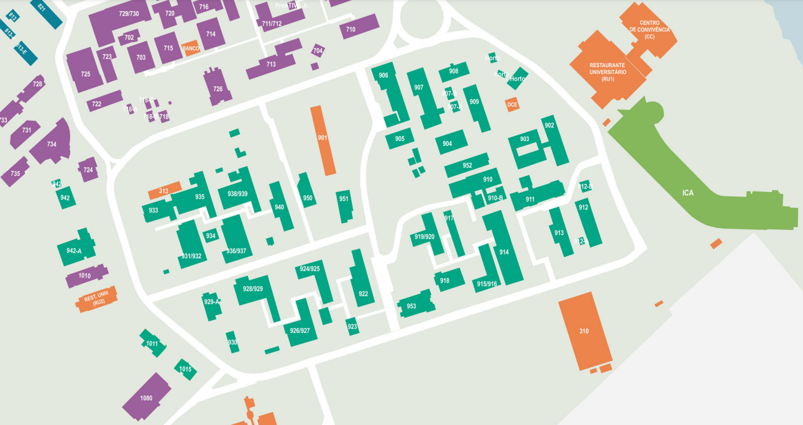

# Seminários de Ciência de Dados

##### Universidade Federal do Ceará

*Prof. Michael Ferreira de Souza*
michael@ufc.br
(85) 99821 - 9955

---

## Carga Horária e Encontros

32h teóricas, quartas das 14h às 16h.

## Justificativa

*É importante ...*

1. Conhecer a estrutura universitária (departamentos, corpo docente, etc.),
2. Ter uma visão geral sobre a Ciência de Dados,
3. Conhecer a profissão, as áreas de atuação, os estágios e bolsas de estudo. 

---

## Campus do PICI

---

## Centro de Ciências

---

## Objetivos

*Apresentar ...*

- a estrutura universitária, 
    - Pró-Reitorias
    - Centro de Ciências
    - Departamentos 
    - Corpo Docente

---

## Objetivos

*Apresentar ...*

- o Projeto Pedagógico de Curso (PPC)
    - a Estrutura Curricular
    - Estágio
    - Monografia
    - Atividades Complementares

---

## Objetivos

*Apresentar ...*
- A organização universitária 
- Políticas de apoio ao estudante
    - Pró-Reitoria de Assuntos Estudantis (PRAE), ]
    - Empresa Júnior 
    - Centro Acadêmico e Representação Estudantil

---

## Objetivos

*Apresentar ...*
- Os programas de Pós-graduação (DEMA, DC). 
- Profissão do Cientista de Dados
    - Áreas de Atuação,
    - Oportunidades de Estágios e Empregos, 
    - Bolsas de Estudo existentes.

---

## Bibliografia Básica

1. Projeto Político Pedagógico do Bacharelado em Ciência de Dados da UFC.
2. David Donoho. 50 years of data science. Journal of Computational and Graphical Statistics, 26:745–766, 2017.

---

## Bibliografia Complementar

1. De Veaux, Richard D., et al. *Curriculum guidelines for undergraduate programs in data science*. Annu Rev Stat Appl 4 (2017).
3. Andrea Danyluk and Paul Leidig. *Computing competencies for undergraduate data science curricula: Acm data science task force*. Association of Computing Machinery (ACM), 2021.
4. Cao, Longbing. *Data science: challenges and directions*. Communications of the ACM 60.8 (2017).

---

## Descrição do Conteúdo/Unidades (1/8)

1. **Apresentação da Estrutura Universitária e Corpo Docente**
   - Introdução à disciplina.
   - Visão geral da estrutura universitária: 
        - Pró-Reitorias, Departamentos, ...
   - Apresentação dos professores e áreas de pesquisa.

2. **Estrutura Curricular e Programas de Pós-Graduação**
   - Estrutura Curricular do 
   Bacharelado em Ciência de Dados da UFC.
   - Programas de pós-graduação.

---

## Descrição do Conteúdo/Unidades (2/8)

3. **Políticas de Apoio ao Estudante**
   - Apresentação das políticas de apoio ao estudante: 
        - PRAE, Empresa Júnior, Centro Acadêmico.
   - Oportunidades extracurriculares e 
   de engajamento estudantil.

4. **Profissão e Áreas de Atuação em Ciência de Dados**
   - Áreas de atuação em Ciência de Dados.
   - Demandas do mercado de trabalho e perspectivas.
   - Apresentação do Instituto Euvaldo Lodi (IEL).

---

## Descrição do Conteúdo/Unidades (3/8)
   
5. **Estágios, Empregos e Bolsas de Estudo**
   - Estágios, oportunidades de emprego e bolsas de estudo.
   - Experiências pré-profissionais e suas implicações.
   
6. **Visão Geral sobre Ciência de Dados: Parte 1**
   - Introdução aos fundamentos da Ciência de Dados.
   - Desenvolvimento de Sistemas e Engenharia de Dados.

---

## Descrição do Conteúdo/Unidades (4/8)
   
7. **Visão Geral sobre Ciência de Dados: Parte 2**
   - Otimização e Mineração de Dados.
   - Apresentação de casos de uso e aplicações práticas.
   
8. **Visão Geral sobre Ciência de Dados: Parte 3**
   - Aprendizagem de Máquina e Métodos Estatísticos.
   - Exemplos e demonstrações de algoritmos e técnicas.

9. **Extensão e Perspectivas em Ciência de Dados**
   - Curricularização da Extensão.
   - Apresentação de perspectivas futuras e tendências na área.

---

## Descrição do Conteúdo/Unidades (5/8)

10. **Palestra: Tema 1**
    - Palestra sobre tema de pesquisa/aplicação 
    em Ciência de Dados.

11. **Palestra: Tema 2**
    - Continuação da série de palestras, com outro docente abordando um tópico de interesse.

---

## Descrição do Conteúdo/Unidades (6/8)

   
12. **Seminário de Trabalho em Grupo: Parte 1**
    - Início da preparação para o seminário final, com a formação de grupos e escolha de temas.

13. **Seminário de Trabalho em Grupo: Parte 2**
    - Continuação da preparação dos grupos, com pesquisa e elaboração do conteúdo.
   
14. **Seminário de Trabalho em Grupo: Parte 3**
    - Treinamento e ensaio das apresentações dos grupos.

   
---

## Descrição do Conteúdo/Unidades (8/8)

15. **Seminário de Trabalho em Grupo: Parte 4**
    - Realização dos seminários pelos grupos, com apresentações e discussões.
   
16. **Avaliação e Encerramento**
    - Feedback sobre os seminários e 
    avaliação do desempenho dos alunos.
    - Encerramento do curso e considerações finais.

---

## Metodologia de Ensino

Aulas expositivas, palestras de convidados, estudos de caso e apresentação de trabalhos em grupo.

## Atividades Discentes

Participação em aulas e apresentação de trabalhos em grupo.

---

## Avaliação

Baseada na participação em aula (frequência) e na qualidade dos trabalhos apresentados. 

 

$$M_{final} = 0.2 \times F + 0.4 \times R + 0.4 \times A,$$

 

$$F = \frac{\#F_{max} - \#F}{\#F_{max}}$$

---

## Projeto

Elaboração de ***relatório comparando a proposta do Bacharelado em Ciência de Dados*** da UFC com o de outras ***duas universidades***, sendo uma ***brasileira*** e outra ***estrangeira***. 

O objetivo é analisar as ***semelhanças e diferenças*** entre os cursos, identificando ***pontos fortes e fracos***. 

---

## Etapas do projeto

1. Escolha das universidades a serem comparadas. 
    - Explique os critérios de seleção.
    - Justifique a escolha das instituições.

2. Coleta de informações sobre os cursos de Ciência de Dados de cada universidade.
    - Estrutura curricular, corpo docente, áreas de pesquisa, etc.
    - Documente as fontes de informação.   

---

## Etapas do projeto

3. Análise e comparação das propostas curriculares.
    - Organize as informações de forma clara e objetiva.
    - Identifique semelhanças e diferenças entre os cursos.
    - Aponte pontos fortes e fracos de cada um.    

---

## Etapas do projeto

4. Preparação da apresentação oral e do relatório escrito.
    - Organize as informações de forma clara e objetiva.
    - Faça uma introdução, desenvolvimento e conclusão. 
    - O relatório deve ter entre 5 e 10 páginas.
    - Insiras as referências bibliográficas.
    - Prepare slides para a apresentação.
    - Duração de 15 a 20 minutos e, no máximo, 10 slides.

---

## Etapas do projeto
5. Apresentação dos resultados em sala de aula.
    - Seja claro e objetivo.
    - Esteja preparado para responder perguntas e discutir/conversar sobre os resultados.    

---

<!-- backgroundColor: orange -->
<!-- _color: black -->
# Dúvidas?