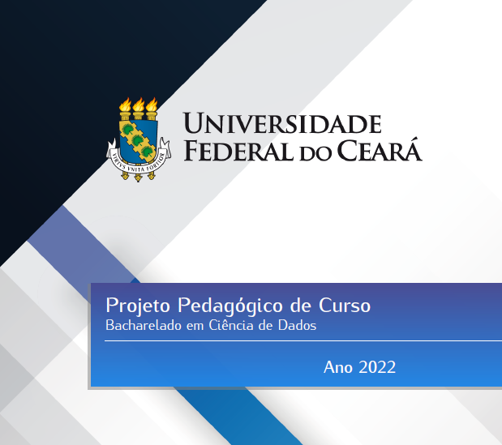
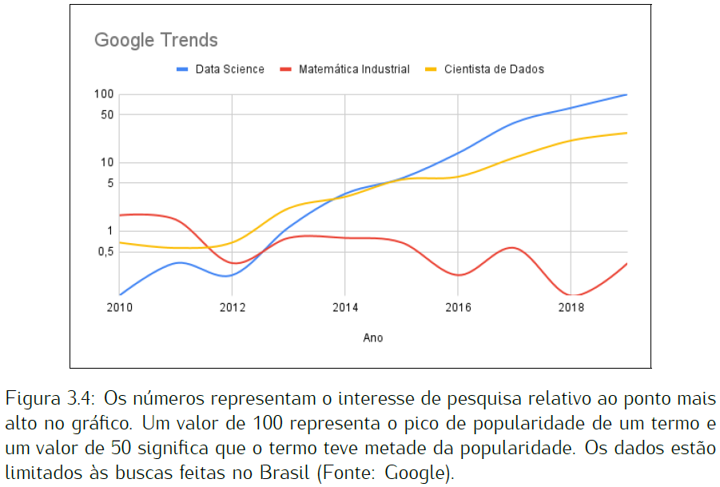
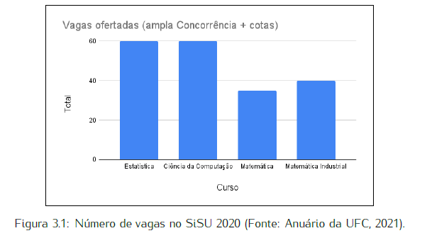
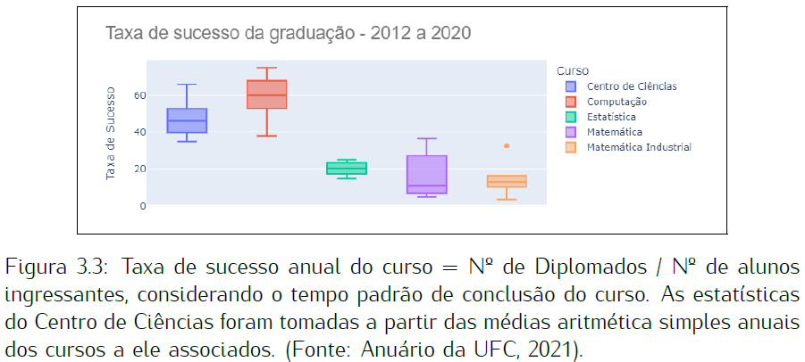
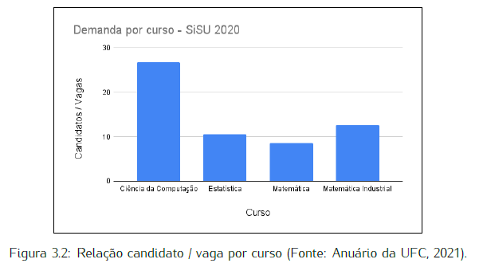
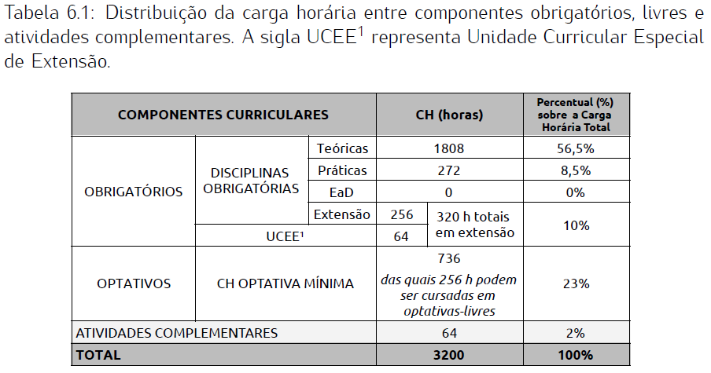

# Seminários de Ciência de Dados

##### Universidade Federal do Ceará

*Prof. Michael Ferreira de Souza*
michael@ufc.br
(85) 99821 - 9955

---

## Projeto Pedagógico de Curso (PPC)

---

## Histórico

O curso de Bacharelado em Ciência de Dados da UFC é uma reformulação do curso de Bacharelado em Matemática Industrial, que foi criado em 2010.

---

---

---

---

## Proposta

---

<!-- backgroundColor: orange -->
<!-- _color: black -->
# Dúvidas?