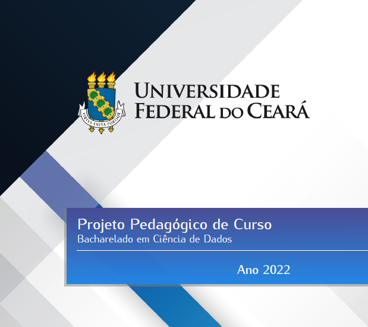

# Seminários de Ciência de Dados

##### Universidade Federal do Ceará

*Prof. Michael Ferreira de Souza*
michael@ufc.br
(85) 99821 - 9955

---

## Projeto Pedagógico de Curso (PPC)

---

# Atividades Complementares

---

A Resolução N°07/CEPE, de 17 de Junho de 2005, estabelece que as ***Atividades Complementares*** são estratégias que integram teoria e prática, expandindo conhecimentos e habilidades dos estudantes. 

Essas atividades, de ***iniciativa livre*** dos alunos, devem totalizar 64 horas ou 04 créditos. 

---
## Quais são as possíveis atividades complementares?

1. Atividades de Iniciação à Docência, à Pesquisa e/ou Extensão (até 64 horas);
2. Atividades artísticas, culturais e/ou esportivas (até 32 horas);
3. Atividades de participação e/ou organização de eventos (até 32 horas);
4. Atividades de iniciação profissional (ensino, estágio, DUAL) (até 32 horas);
5. Produção técnica/científica (artigo, resumo em congresso) (até 64 horas);
6. Vivências ou experiência em gestão (colegiados, CA, DCE) (até 32 horas);
7. Cursos de formação (idiomas, workshops, mini-cursos) (até 32 horas);

---

<!-- backgroundColor: orange -->
<!-- _color: black -->
# Dúvidas?
