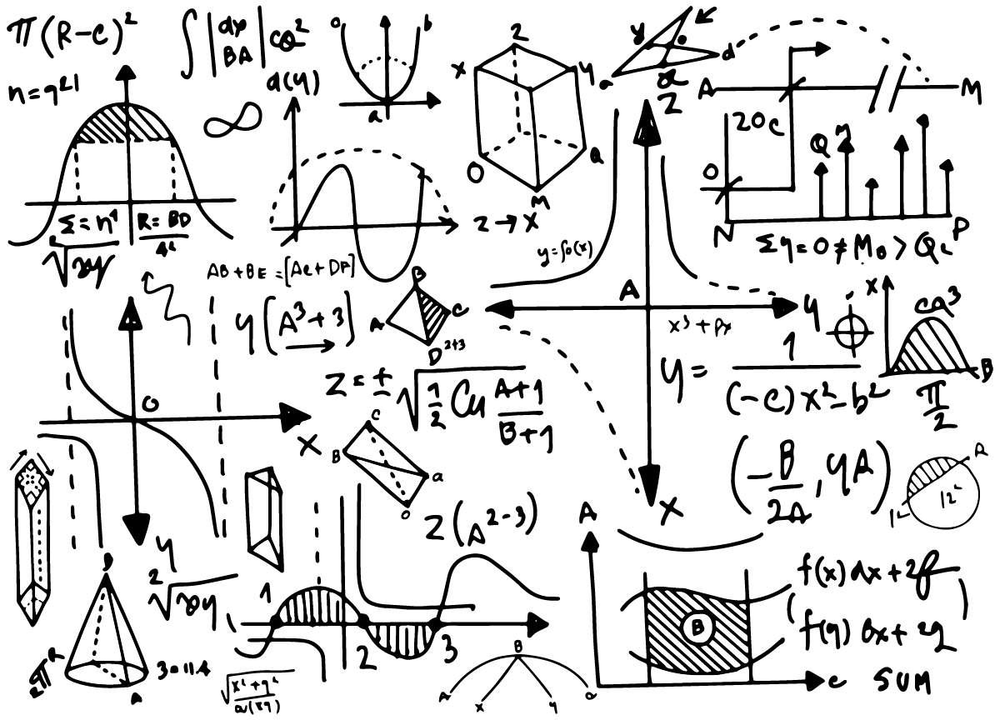
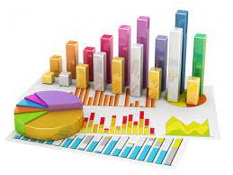
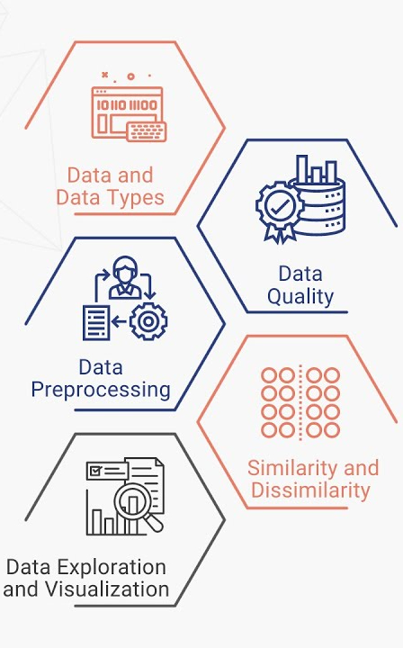
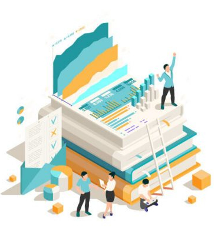
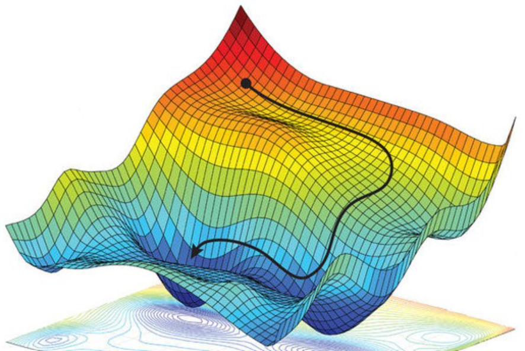

# Seminários de Ciência de Dados

##### Universidade Federal do Ceará

*Prof. Michael Ferreira de Souza*
michael@ufc.br
(85) 99821 - 9955

---

# Unidades Curriculares

1. Extensão
2. Otimização
3. Métodos Estatísticos
4. Engenharia de Dados
5. Desenvolvimento de Sistemas
6. Fundamentos de Ciência de Dados
7. Mineração de Dados e Inteligência Artificial

---

## Fundamentos de Ciência de Dados

– Álgebra Linear
– Cálculo Fundamental I
– Cálculo Fundamental II
– Cálculo Fundamental III
– Cálculo Numérico
– Fundamentos de Matemática para Ciência de Dados
– Laboratório de Ciência de Dados
– Seminários em Ciência de Dados

---

## Métodos Estatísticos

– Análise Exploratória de Dados
– Análise Inferencial
– Introdução aos Processos Estocásticos
– Modelagem Estatística
– Modelos Probabilísticos

---

## Mineração de Dados e Inteligência Artificial

– Aprendizagem de Máquina
– Inteligência Artificial
– Mineração de Dados

---

## Engenharia de Dados

– Administração de Bancos de Dados
– Fundamentos de Bancos de Dados
– Privacidade de Dados
– Sistemas de Armazenamento de Dados Não-Relacionais
– Sistemas de Gerenciamento de Banco de Dados

---

## Otimização

– Construção e Análise de Algoritmos
– Metaheurística
– Programação Inteira
– Programação Linear
– Programação Não-Linear

---

## Extensão
– Competições e Desafios em Ciência de Dados
– Comunicação com Dados
– Economia Solidária Digital
– Educação Midiática
– Estatística Aplicada
– Interfaces de Programação de Aplicação
– Introdução à Divulgação Científica
– Pensamento Computacional na Educação Popular

---
<!-- backgroundColor: orange -->
<!-- _color: black -->
# Dúvidas?
