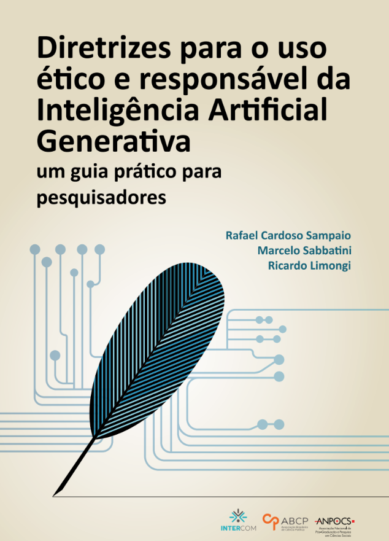
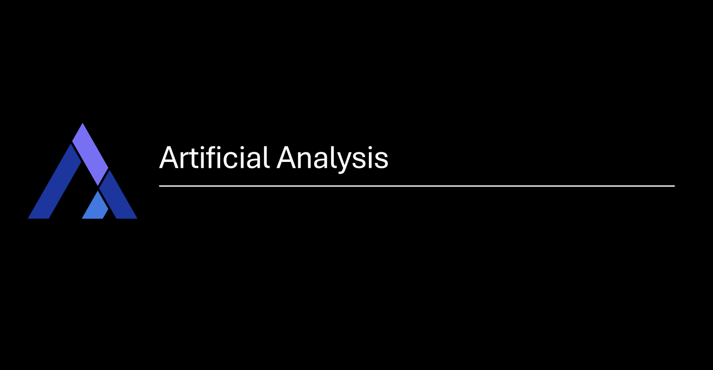
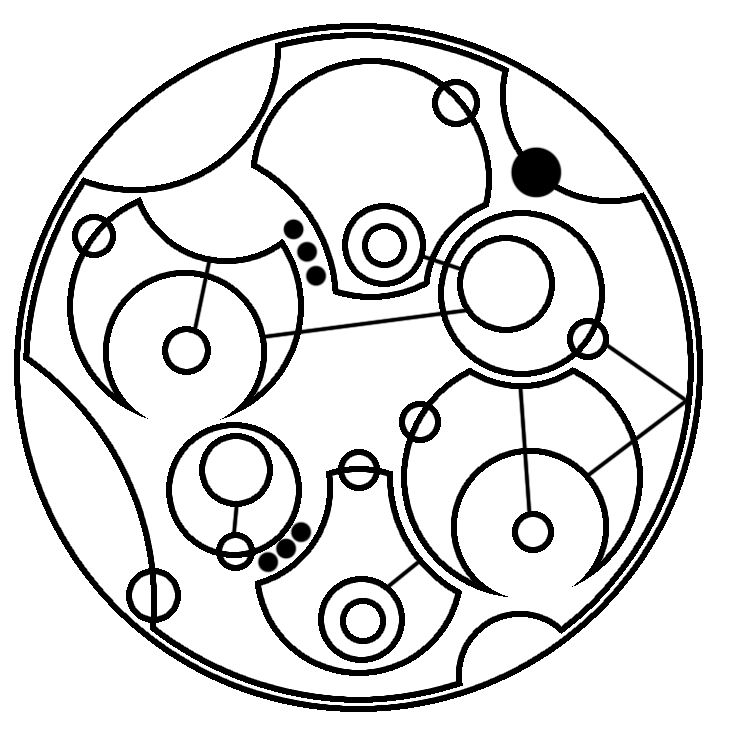
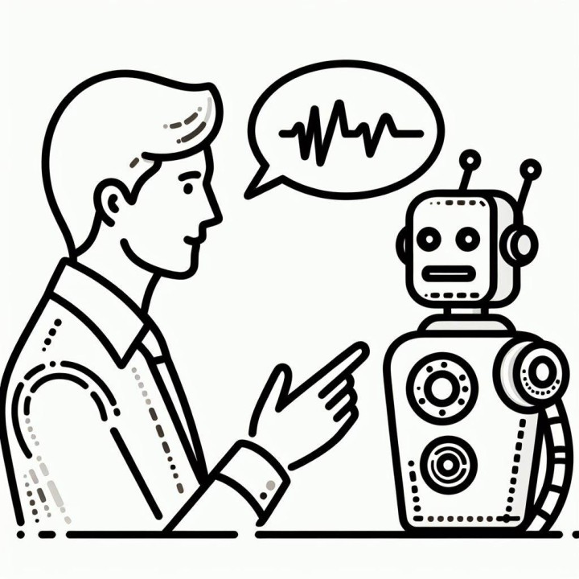
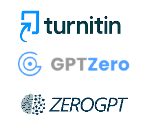
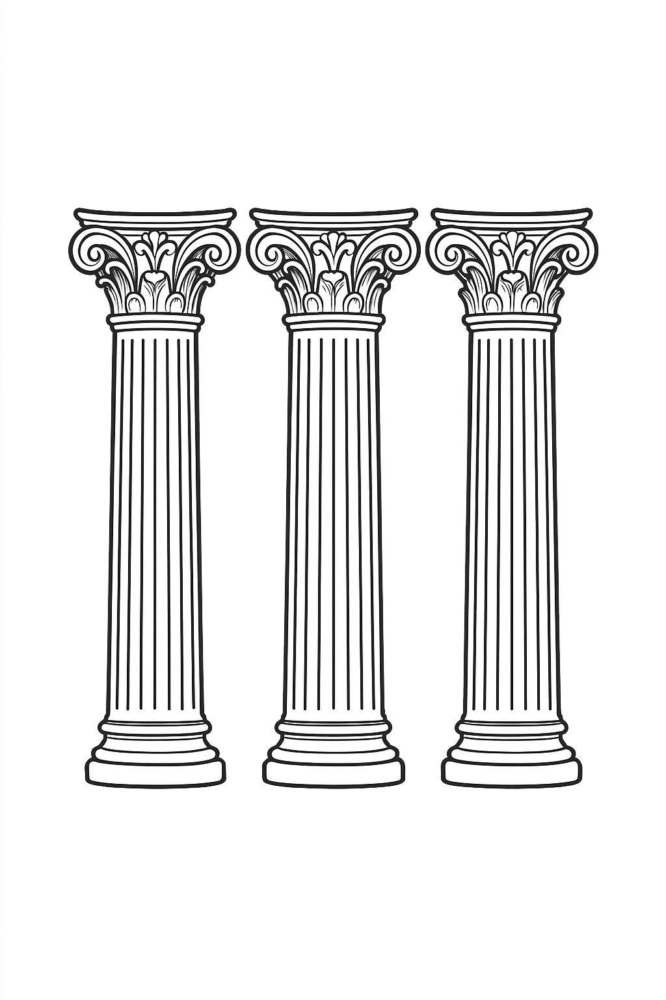
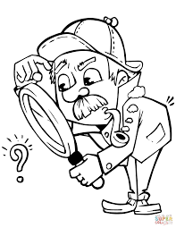
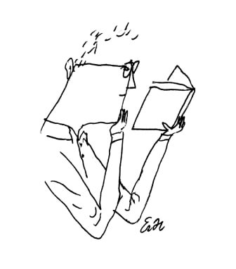
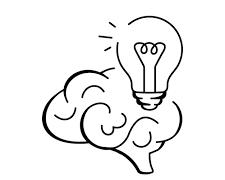

# Guia Prático de IA Generativa

##### Universidade Federal do Ceará

*Prof. Michael Ferreira de Souza*
michael@ufc.br
(85) 99821 - 9955

---

## Ferramentas de IA Generativa

---

---

### Repositórios Gerais de IA

| Repositório | Link|
| :--- | :--- |
| AI Library | `https://library.phygital.plus/` |
| Futurepedia | `https://www.futurepedia.io/` |
| Product Hunt | `https://www.producthunt.com/` |
| There's An AI For That | `https://theresanaiforthat.com/` |
| Top AI | `https://topai.tools/` |

---

### Grandes Modelos de Linguagem (LLMs)

| Ferramenta | Link |
| :--- | :--- |
| ChatGPT | `https://chatgpt.com/` |
| Gemini | `https://gemini.google.com/` |
| Claude | `https://claude.ai/` |
| Copilot | `https://copilot.microsoft.com/` |
| Hugging Face | `https://huggingface.co/` |
| Maritalk | `https://chat.maritaca.ai/` |
| Mistral | `https://chat.mistral.ai/` |
| Storm | `https://storm.genie.stanford.edu/` |

---

### **E os Detectores de IA?**

*   Ferramentas como **Turnitin, GPTZero e ZeroGPT** existem para detectar texto de IA.
*   **CUIDADO**: A **precisão e confiabilidade** dessas ferramentas são **altamente contestadas**.
*   **Falsos Positivos**: Podem erroneamente classificar texto humano (especialmente de não-nativos em inglês) como gerado por IA.
*   O foco das instituições deve ser na **educação sobre boas práticas**, e não apenas na punição baseada em ferramentas falíveis.

---

## Uso Responsável da IAG

---

## Princípios Fundamentais

O uso da Inteligência Artificial Generativa (IAG) na graduação deve ser guiado por:

*   **Compreensão Ética:** Conhecer os limites e responsabilidades.
*   **Agência Humana:** Manter o controle e o pensamento crítico.
*   **Cuidados Específicos:** Aplicar boas práticas em cada etapa do trabalho.

A IAG é uma **ferramenta de auxílio**, não um substituto para o seu intelecto.

---

## 1. Autoria Humana e Responsabilidade

*   Ferramentas de IAG (ChatGPT, Copilot, etc.) **não podem ser listadas como autoras**. A autoria exige responsabilidade legal.

*   **Somente humanos** podem garantir a originalidade, precisão e integridade do trabalho.

*   **Você é 100% responsável**. Revise e edite tudo cuidadosamente.

*   A aprovação final do produto acadêmico é sempre uma **tarefa humana**.

---

## 2. Transparência no Uso da IAG

É essencial ser transparente para garantir a replicabilidade e a confiabilidade do seu trabalho.

*   **Descreva claramente** como a IAG foi utilizada na pesquisa.
*   **Especifique:**
    *   Nome da ferramenta (ex: ChatGPT)
    *   Modelo e versão (ex: GPT-4)
    *   Data de uso
*   Algumas editoras sugerem uma **declaração específica** ao final do manuscrito.

---

## 3. Integridade Acadêmica e Plágio

*   A IAG pode gerar resultados que infringem direitos autorais, resultando em **plágio**.

*   É seu dever **garantir a originalidade** e citar todas as fontes adequadamente.

*   **NÃO carregue trabalhos não publicados ou dados sensíveis** em sistemas de IA online, pois podem ser usados para treinar os modelos.

*   A IA pode gerar plágio não intencional.

---

## 4. Agência Humana e Pensamento Crítico

*   A IAG é uma **ferramenta complementar**, não um substituto para seu aprendizado.

*   O material gerado **frequentemente contém erros, vieses ou invenções**. O risco é alto se você não domina o tema.

*   A **dependência excessiva** inibe o desenvolvimento de habilidades críticas, criatividade e pensamento independente.

*   Mantenha uma **postura crítica**: a IA não é sua orientadora ou parceira acadêmica.

---

## 5. Letramento em IA (AI Literacy)

*   **Desenvolva sua literacia em IA**: conheça os princípios, limitações e vieses.

*   Aprenda a elaborar **bons "prompts"** (engenharia de prompts) para obter respostas de melhor qualidade e refinar seu pensamento.

*   **Equilibre** o uso da IAG com o desenvolvimento contínuo das suas habilidades de escrita e análise.

---

## Aplicações Práticas

---

### **Brainstorming e Exploração de Ideias**

*   **Cuidado com vieses**: A IAG pode reforçar uma visão anglo-saxã da ciência e ser superficial.
*   **Verifique a originalidade**: Garanta que as ideias geradas não são de outros autores para evitar plágio.
*   **Priorize fontes tradicionais**: Use a IA como ponto de partida, mas aprofunde com sua própria análise e pesquisa em fontes confiáveis.

---

### **Busca de Materiais Acadêmicos**

*   **Use ferramentas especializadas**: Prefira IAs acadêmicas (ex: Consensus, Elicit) em vez de LLMs de uso geral para esta tarefa.
*   **Combine com bases de dados tradicionais**: Sempre valide as fontes em plataformas como SciELO, Scopus e Web of Science.
*   **ALERTA**: IAGs podem **inventar citações e referências**. Verifique todas as fontes.

---

### **Leitura e Resumo de Artigos**

*   **Proteja seus dados**: **Não envie materiais inéditos ou sensíveis** para as plataformas.
*   **Valide os resumos**: Eles podem conter informações falsas, incompletas ou inventadas.
*   **Nada substitui a leitura crítica**: A leitura completa do material é essencial para o seu desenvolvimento intelectual e compreensão profunda.

---

### **Escrita Acadêmica**

*   **NUNCA "copie e cole"** o texto gerado pela IA.
*   **Use para auxílio técnico**: Ideal para correções de gramática, ortografia ou para sugerir melhorias.
*   **Mantenha sua voz autoral**: A escrita acadêmica é uma habilidade fundamental a ser desenvolvida.

---

<!-- _backgroundColor: #FFD700 -->

# Dúvidas?